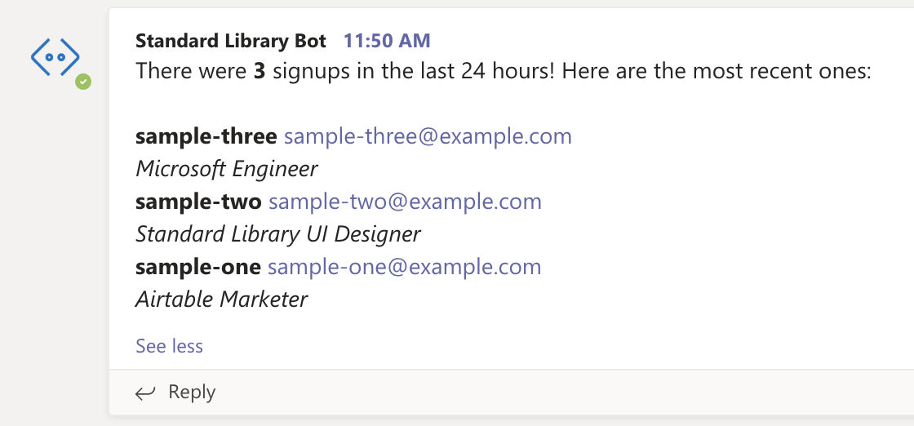

# Microsoft Teams + Airtable Daily Metrics Bot

## Deploy in Seconds

This is a Microsoft Teams bot that, once a day, will query Airtable for new signups in the last day, and will send a count to your channel along with more detailed information on up to ten of the most recent signups.

Setup is simple –– you can deploy it without writing any code or configuring any files due to Standard Library's [Identity Token](https://docs.stdlib.com/identity-management-sso-for-apis/what-is-an-identity-token/) support! The only things you need to do are to add the Standard Library bot to your Microsoft Teams organization, set up a target Airtable base, link those to resources, and deploy.

## Setting Up Your Airtable Base

To set up an Airtable base with the proper fields, follow this link to copy the base into your own Airtable workspace: https://airtable.com/addBaseFromShare/shrLYjygH0wHqxuEm. Your base should look something like the one in the image below.

**Note:** You'll notice that the **Created At** fields for each entry are actually set for 2030 –– this is just for testing purposes. Our workflow will check for any rows with a **Created At** field greater than 24 hours before execution, and setting this date in the future ensures that we'll have some sample data to show.

## Installing Your Bot Into Teams

## Deploying to Standard Library

Once you've set up your Airtable base and installed the Standard Library app into your Microsoft Teams organization, click the button below to open this repo in [Autocode](https://autocode.stdlib.com/):

You should see a screen like this:

Save your project, then open `functions/events/scheduler/daily.js` in the sidebar and click the red **2 Accounts Required** button in the lower right corner.

You'll then see a modal appear that will prompt you to link the Airtable base you just created and select a specific team within your Microsoft Teams organization where you would like to receive updates.

Once you've linked the required resources, press the orange **Save Endpoint** button in the bottom left corner of the editor. Finally, press the blue **Deploy** button to deploy your project live.

That's it, you're all done! Your bot should be ready to go.

# Thank You!

Please check out [Standard Library](https://stdlib.com/) or follow us on Twitter,
[@StdLibHQ](https://twitter.com/@StdLibHQ).